author: shotaro.doi
summary: swiftのオンボーディングプロジェクト
id: startaiyo-swift-onboarding
categories: codelab, markdown
environments: Web
status: ok
feedback link: https://github.com/startaiyo/swift-onboarding
analytics account: Google Analytics ID

# Swift Onboarding Project
## はじめに
### 本オンボーディングの目的
- 簡単なアプリの作成を通じて、Swiftの基本を学び、配属先での業務に活かす。
- [Swiftのロードマップ](https://medium.com/@andres.carort/ios-developer-roadmap-2023-330fd5cb7479)に基づき、Swiftの網羅的な知識を実装レベルにまで持っていってもらう。
### 学習内容
1. ログイン画面を表示する。<!-- AppDelegate、storyboardの説明と最初の画面表示 -->
2. メイン画面にデータを表示する。 <!-- MVVMでデータ表示のためのファイル分割 -->
3. メイン画面へ移動可能にする。<!-- Coordinator、NavigationControllerの説明と遷移 -->
4. APIを叩いてデータを取得する。 <!-- Services/Modelの作成でデータ取得 -->
5. データを保存する。<!-- Realmやfirebaseを使ってlocal/remoteにデータ保存 -->
6. 取得したデータをリアルタイムで更新する。<!-- Async awaitで取得データのリアルタイム反映 -->
7. エラーを表示する <!-- エラーハンドリング -->
8. チャット画面を作ってみる <!-- SwiftUIを使う -->
9. ログイン機能を作る。<!-- firebase authで作ってみる -->
10. <!-- 未定。他の技術を試しに使ってみる。 -->

### 必要な準備
- [Xcode](https://developer.apple.com/xcode/) *必須
  - Versionは15.2
- Apple Developerアカウント

## 第一章 ログイン画面を表示する
### 概要
ダミーのログイン画面の作成を通じて、アプリ全体に関わる処理に関する知識を学びます。
### 本章で学ぶこと
- [AppDelegate](https://developer.apple.com/documentation/uikit/uiapplicationdelegate)
- [SceneDelegate](https://developer.apple.com/documentation/uikit/uiscenedelegate)
- [storyboard](https://developer.apple.com/documentation/uikit/uistoryboard)
- [AutoLayout](https://developer.apple.com/library/archive/documentation/UserExperience/Conceptual/AutolayoutPG/index.html)
### 完成イメージ

|iPhone|iPad|
|-|-|
|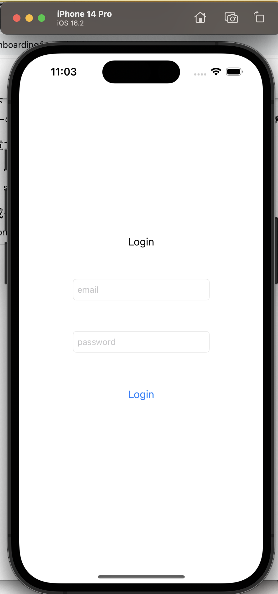|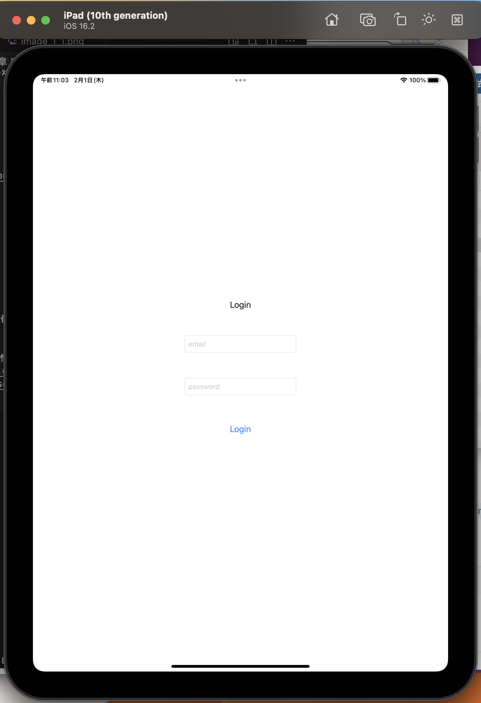|

### 手順
**Xcodeのプロジェクトを作る**
1. Xcodeを開き、Create a new Xcode projectを選ぶ。
2. iOS > Appを選ぶ  
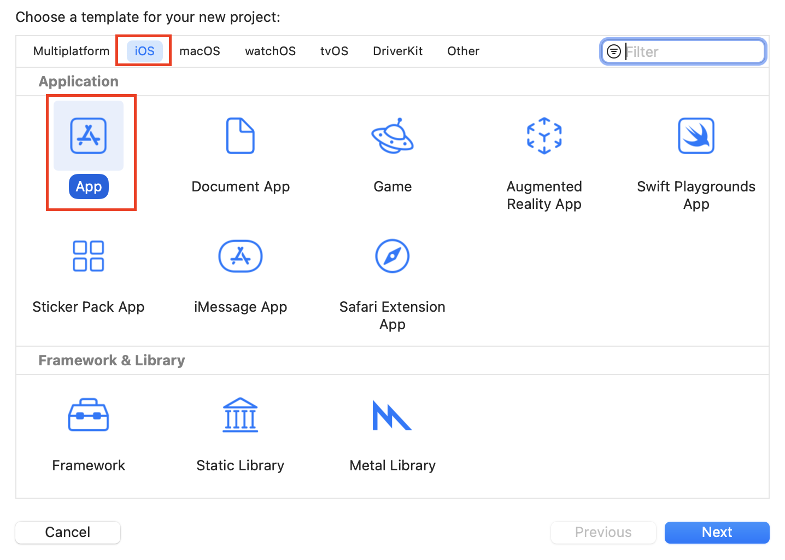

3. 任意の名前をつけ、プロジェクトを保存する。

**GitHubのリポジトリを作る**
1. Source control navigator > Repositories > Remotes(画像参照)を右クリック  
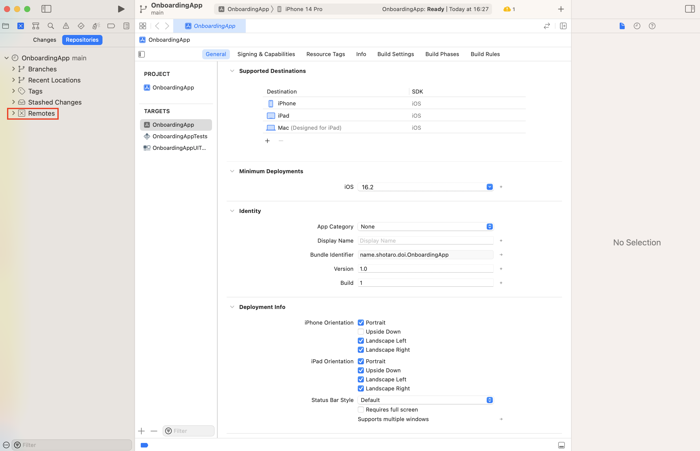

2. New "App名" Remote...をクリックし、自分のGitHubアカウント情報を入力する。
3. Personal access tokenについては、[こちら](https://docs.github.com/ja/authentication/keeping-your-account-and-data-secure/managing-your-personal-access-tokens) を参考にし、前手順で指定されたscopeを持ったPersonal access tokenを発行し、登録する。

以上でGitHubとの連携は完了です。

**画面表示のための下準備**
1. info.plistというファイルを開き、`Information Property List`内にある`Application Scene Manifest`をマイナスボタンで削除する。
2. SceneDelegate.swiftを物理削除する。
3. AppDelegateから以下の二つの関数を削除する。
```
func application(_ application: UIApplication, configurationForConnecting connectingSceneSession: UISceneSession, options: UIScene.ConnectionOptions) -> UISceneConfiguration {
    // Called when a new scene session is being created.
    // Use this method to select a configuration to create the new scene with.
    return UISceneConfiguration(name: "Default Configuration", sessionRole: connectingSceneSession.role)
}

func application(_ application: UIApplication, didDiscardSceneSessions sceneSessions: Set<UISceneSession>) {
    // Called when the user discards a scene session.
    // If any sessions were discarded while the application was not running, this will be called shortly after application:didFinishLaunchingWithOptions.
    // Use this method to release any resources that were specific to the discarded scenes, as they will not return.
}
```
4. AppDelegateクラス定義内に以下変数を追加する。

```
var window: UIWindow?
```

- ?(オプショナル型)については後述

5. Main.storyboard, ViewControllerを削除する。
6. 図のようにAppの設定 > TARGETSのApp名 > Info > Main storyboard file base name を削除する(写真は削除した後。)

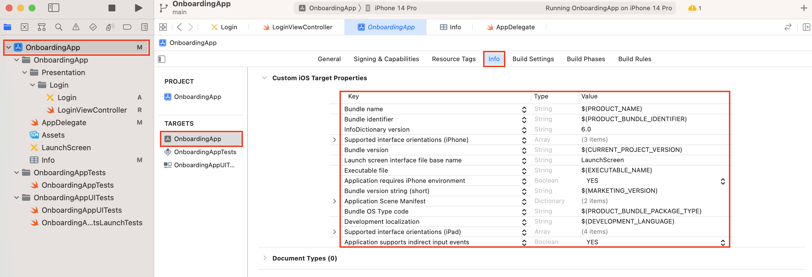

7. AppDelegateの`func application(_ application: UIApplication, didFinishLaunchingWithOptions launchOptions: [UIApplication.LaunchOptionsKey: Any]?) -> Bool` 内に

```
window = UIWindow(frame: UIScreen.main.bounds)
let storyBoard = UIStoryboard(name: "Login", bundle: nil)
let loginVC = storyBoard.instantiateViewController(withIdentifier: "LoginViewController")
window?.rootViewController = loginVC
window?.makeKeyAndVisible()
```

を追加します。※このままでは動きません。
次に、ログイン画面を作っていきます。

**ログイン画面の表示**
1. AppDelegateが含まれているApp名のディレクトリで右クリックし、New Groupを選択すると、新たなディレクトリが作れる。名前は"Presentation"(画面表示に関わるファイルを格納するディレクトリ)にする。
2. Presentationディレクトリの下に、ログイン画面に関わるファイルを格納する"LoginScene"ディレクトリを作成する。
3. Loginディレクトリで右クリックし、New Fileを選択 > iOS > User Interfaceにある"Storyboard"を選択。名前は"Login"にし、保存。  
- すると、下記のような白地のiPhoneが出てくると思います。ここにパーツを置き、画面を完成させます。

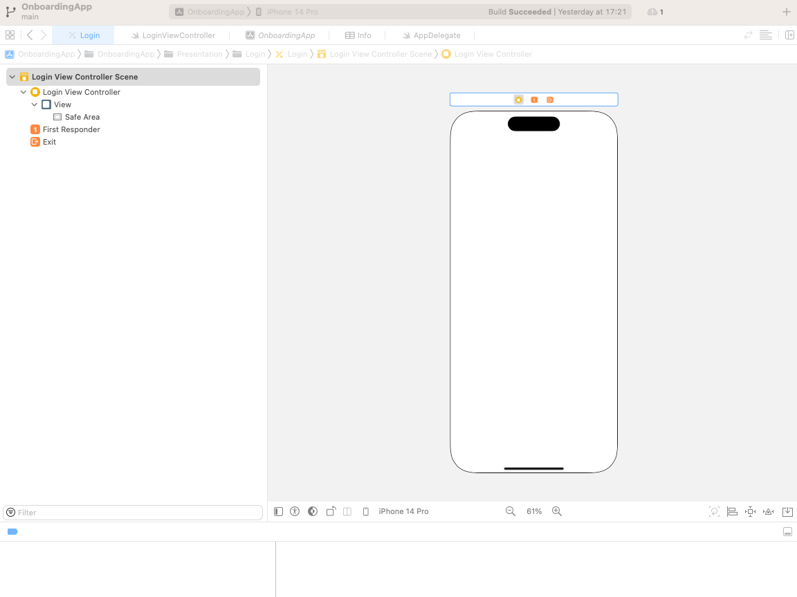

4. LoginディレクトリでさらにNew File > iOS > SourceのSwift Fileを選択し、名前を`LoginViewController`にする。
5. そして、デフォルトで存在する`import foundation`を削除したのちに以下のコードを記述し、LoginViewControllerクラスを作成する。

```
import UIKit

final class LoginViewController: UIViewController {}
```

- これがコードとstoryboardを橋渡ししてくれます。

6. 再びLogin.storyboardに戻り、左側のDocument Outlineの赤枠で囲ったView Controllerをクリック > 右側のInspectorsの赤枠で囲ったCustom Class > ClassからLoginViewControllerを選択。そして同じく赤枠のIdentity > Storyboard IDにも同様に`LoginViewController`を入力。

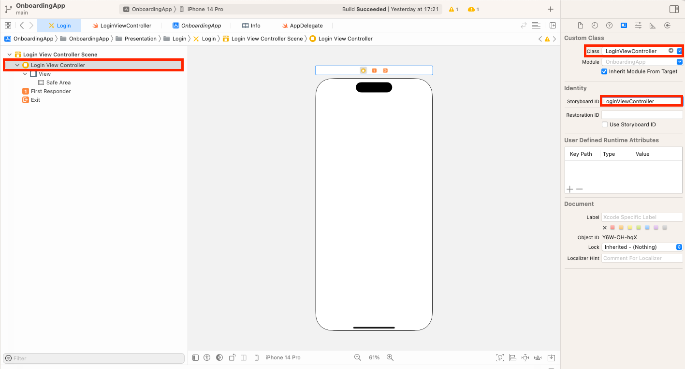

- これでコード上から参照できるようになりました。

7. 右上の赤枠で囲った"➕"ボタン(以下、library)をクリックすると画面に配置できるパーツ一覧が出てくる。まず"Label"をクリックしたまま離さず、白地のiPhoneの上でクリックを離すと、Labelと書かれたパーツが画面上に配置される。

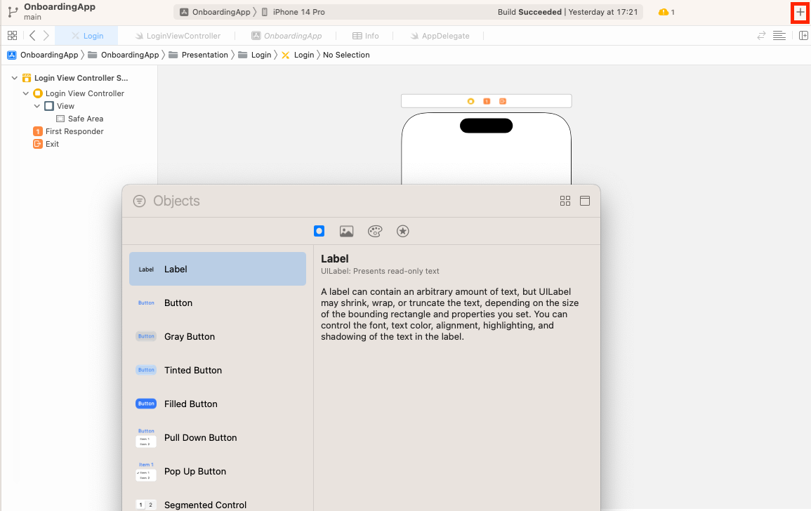

8. ここで試しにXcode左上の再生ボタンを押してビルドしてみると、Labelと書かれた画面が出現する。

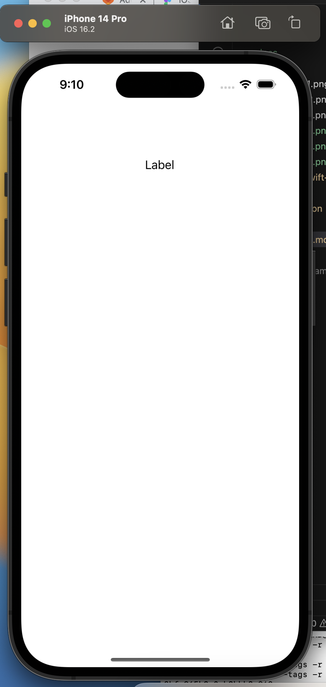

- これで画面表示まではされるようになりました。次に色々なパーツを組み合わせ、ログイン画面を作成していきます。

**ログイン画面の作成**
1. libraryをクリックし、TextFieldを二つ、Buttonを一つ、先ほどのLabelの下に順に配置する。

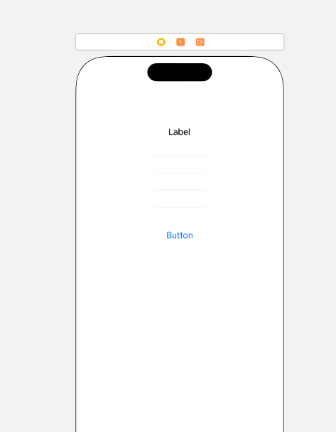

- 基本的に、storyboardはパーツが平面上のどこにあるのかを指定するだけで、ここでは見た目的な部分に修正は加えません。見た目はViewControllerから整えていきます。

2. Add Editor on Right(libraryの+ボタンの下、赤枠)によりxcodeの編集画面を2画面にし、片方のEditorをクリックした後LoginViewController.swiftファイルを開く。
3. もう片方で開いているLogin.storyboard(開いてなければ開く)のLabelを、controlキーを押したままクリック離さずにLoginViewController.swiftファイル上ドラッグすると、図のように青い線と共に`Insert Outlet or Outlet Collection`と出てくる。

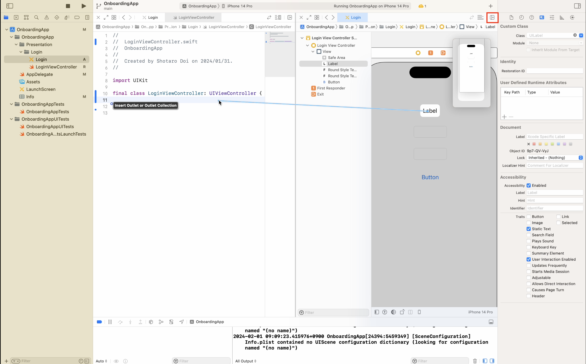

このタイミングでクリックを離し、StorageをStrongにし、nameを`titleLabel`にすると、自動的に

```
@IBOutlet var titleLabel: UILabel!
```

というコードが出現する。しかしこのインスタンスはクラス内からしか参照しないため、`@IBOutlet`と`var`の間に`private`を記述することでそれを明示する。
4. 同様に、上から順にprivateの@IBOutletプロパティである`emailField`, `passwordField`, `loginButton`を作成すると、`LoginViewController.swift`は以下のようなコードになる。

```
import UIKit

final class LoginViewController: UIViewController {
    @IBOutlet private var titleLabel: UILabel!
    @IBOutlet private var emailField: UITextField!
    @IBOutlet private var passwordField: UITextField!
    @IBOutlet private var loginButton: UIButton!
}
```

5. 各パーツのデザインを作る。まず、titleLabelのテキストを"Login"にしたいので、`titleLabel: UILabel!`のすぐ横から以下のコードを記述する。

```
@IBOutlet private var titleLabel: UILabel! {
    didSet {
        titleLabel.text = "Login"
    }
}
```

- これで、LoginViewController上でtitleLabelがインスタンス化された(Setされた)際、titleLabelのtextが"Login"になることを示している。

6. 同様に、各パーツの`didSet`内に下記を記述する。

```
// emailField内
emailField.placeholder = "email"

// passwordField内
passwordField.placeholder = "password"

// loginButton内
loginButton.setTitle("Login",
                                 for: .normal)
```

**各パーツの位置調整**
- 以上の配置は、様々な画面の大きさがあるiOSに対して柔軟性に欠ける。例えば、iPad上に表示しようとした際には以下のようになってしまう。そのため、以下のAutoLayoutの設定を行うことにより、相対的な配置に変える必要がある。

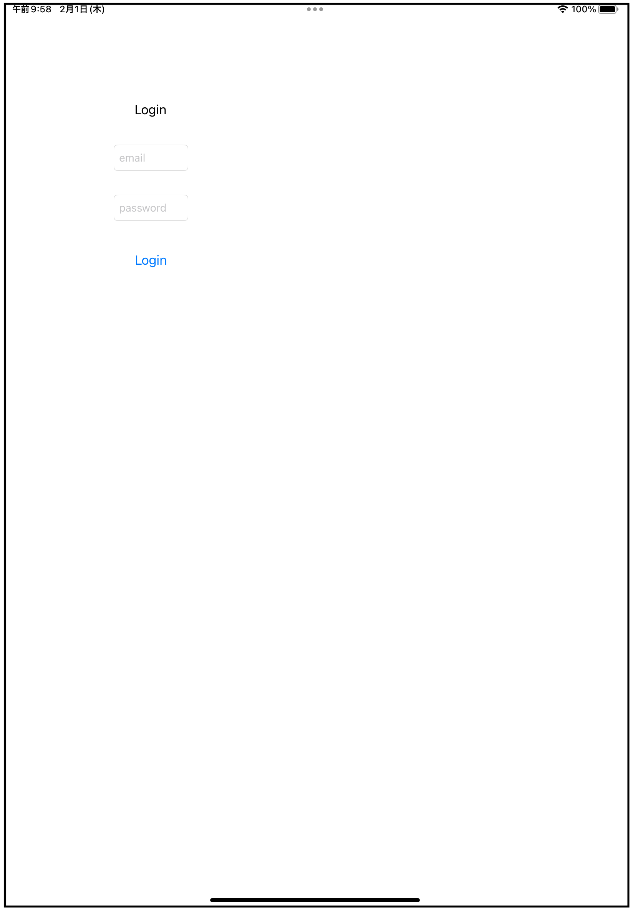

1. まず、以下の手順ですべてのパーツを水平方向の中心に持っていきたい。Title Labelに対して、先程のようにcontrolボタンを押しながらドラッグして出てくる青いポインターを、上部のViewにまでドラッグすると、下図のような黒いポップアップが出てくる。これの"Center Horizontally"をクリックすると、CenterX(水平方向の中心に位置する)の制約(Constraint)が付与される。

- これはすなわち、View(画面全体)に対して、titleLabelは水平方向の中心に配置してください、という制限を我々がかけたことになる。

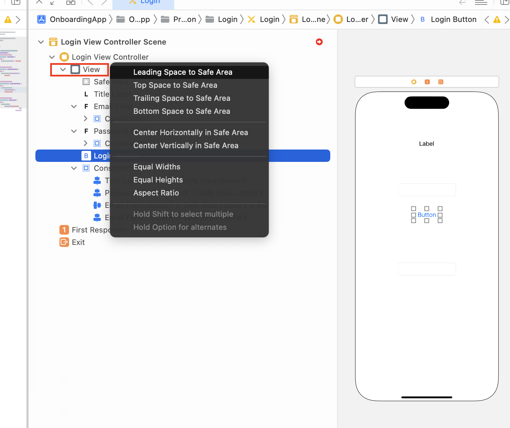

2. 他のパーツについても同様にCenterXのConstraintをViewに対して付与する。
3. 続いて、以下の手順で全てのパーツをY軸方向に50ずつ離して配置する。まず、PasswordFieldにViewに対してCenter VerticallyのConstraintを付与する。
4. 3.で付与されたConstraintをクリックすると、図のようにConstraintの詳細を設定できる部分が開くので、こちらのConstantに25を入力する。

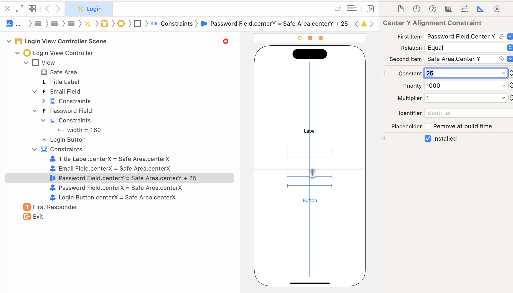

5. emailFieldから今度はpasswordFieldに対して、"vertical spacing"のconstraintを付与する。4.同様に付与されたConstraintを開き、Constantを50に設定する。
6. 同様にtitleLabelからemailField, loginbuttonからpasswordFieldに対してconstantが50のvertical spacingを付与する。
7. テキストフィールドの幅が少し狭いので、emailField, passwordFieldそれぞれに対し、widthのconstantが220のconstraintを設定する。

- 以上により、画面の大きさに関わらず、違和感のない配置にする事ができる。

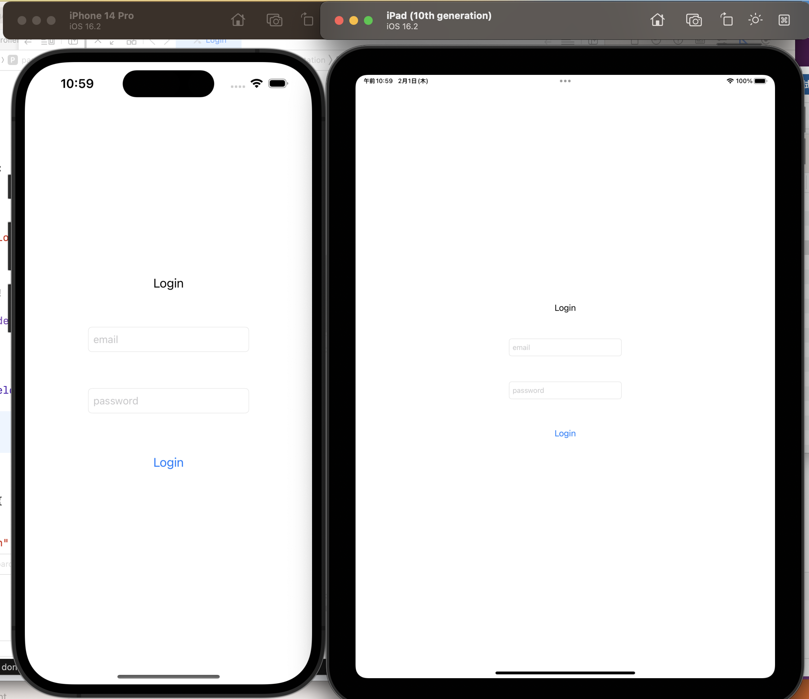

### 各技術の説明
**AppDelegate.swift**
- アプリ全体の変化に関わるイベントを処理するクラス。
- アプリ全体の起動/停止に伴って実行される`didFinishLaunchingWithOptions`, `applicationWillTerminate` だけでなく、画面に関わるライフサイクルイベントもSceneDelegate同様、処理できる。  
どのようなイベントがあるのか詳細は[App States](https://dena0.atlassian.net/wiki/spaces/SPD/pages/657044762/App+States)を参照してください。
- 例えば、アプリを開いた際に画面ロックするかsessionの状態によって決めるメソッドを呼び出すなどで使われる。
- ※Delegate(委譲)とは、自分と異なるクラスに何か処理をさせること。このAppDelegateは、アプリの中心であるUIApplicationのインスタンスがAppDelegateというクラスに上記の処理をDelegateしていると言える。

**SceneDelegate.swift**
- 2画面表示などにより複数のViewインスタンスが必要になったため、それぞれのViewの状態を管理するためのクラス。
- 担っている処理はAppDelegateのアプリライフサイクルに対する処理と同様。

**UIWindow**
- アプリの画面を表すクラス。
- このクラスのインスタンスにより画面上にパーツが配置され、またこれが画面上で起こるイベントを受け取る。

**オプショナル型**
- 変数定義の際、クラス名の末尾に?をつけると、その変数がnil許容であることを示す。その状態ではその変数はラップされており、内部の値を使うためには以下のいずれかの方法でアンラップしてあげなくてはならない。

1. `if let`構文

```
var varA: ClassA?
varA = ClassA()
print(varA) // 出力: Optional(ClassA(...))
// varAがnilじゃない時のみ、アンラップしたvarAと共に{}内の処理を実行する。
if let varA {
    print(varA) // 出力: ClassA(...)
}
```

2. `guard let`構文

```
var varA: ClassA?
varA = ClassA()
print(varA) // 出力: Optional(ClassA(...))
// guardはその条件がtrueの場合のみ、その下の行に続く処理を継続できる構文。falseならelse以下の処理をすることになるため、ここではnilの場合にelseに行くことになる。
guard let varA else { // nilの場合の処理 }
print(varA) // 出力: ClassA(...)
```

3. フォースアンラップ(強制アンラップ)法(非推奨)

```
var varA: ClassA?
varA = ClassA()
print(varA) // 出力: Optional(ClassA(...))
// !マークをつけるだけ。しかし、nilだとクラッシュするため、必ずアンラップできる事が保証できない場合、非推奨。
print(varA!) // 出力: ClassA(...)
```

**storyboard**
- UI上でパーツを並べて画面を作るツール。
- 中身はxibファイル(xmlで部品のレイアウトを記述したもの)となっており、この形でXcode上で認識される。
- Swiftでは大きく分けてUIKit, SwiftUIの2種類のiPhoneアプリ作成用フレームワークがあり、こちらはそのうち前者で多用される。

**AutoLayout**
- 上下左右の4方向に大きさ・長さの制約をかけることで、各パーツのサイズをあらゆる画面の大きさに対応できるようにした方法。
- いろんな種類の制約のかけ方がある。詳しくは[こちら](https://dena0.atlassian.net/wiki/spaces/SPD/pages/657492482/Storyboard+XIB)。

### 各技術の理解
**AppDelegate**

AppDelegateの中に以下のコードを書き、コントロールセンターを開く→閉じる→アプリをバックグラウンドに入れる(注: アプリを終了させないこと)→戻る
とすると、active→inactive→active→inactive→background→(inactive)→activeと呼ばれる事がわかる。
ライフサイクルが[このようになっており](https://developer.apple.com/documentation/uikit/app_and_environment/managing_your_app_s_life_cycle)、各遷移に伴ってAppDelegateの関数が呼ばれるためである。

```
// Inactive→Active
func applicationDidBecomeActive(_ application: UIApplication) {
    print("become active")
}

// Inactive→Background
func applicationDidEnterBackground(_ application: UIApplication) {
    print("enter background")
}

// Inactive→Background
func applicationWillResignActive(_ application: UIApplication) {
    print("become inactive")
}
```

## 第二章 メイン画面にデータを表示する。
### 概要
メイン画面およびそこに表示するデータを作成し、MVVMパターンというデータ表示とデータ作成部分を分割するアーキテクチャを学びます。
### 本章で学ぶこと
### 完成イメージ
### 手順
**メイン画面作成**
- まずは一章と同様の手順により、メイン画面である画像リスト画面ディレクトリ(ImageListScene)を作成していく。
1. ImageList.storyboardを作成し、"+"ボタンで`Collection View`を選択、画面いっぱいに広げ、SafeAreaに四方を合わせたConstraintを設定してください。  
  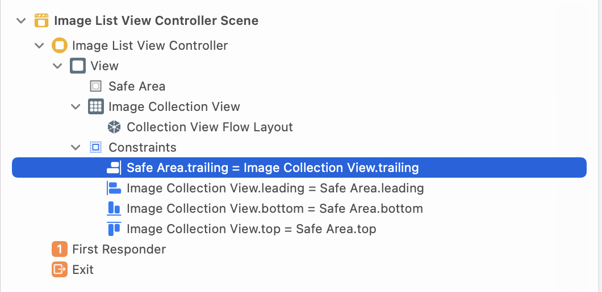  
2. `ImageListViewController.swift`を作成し、以下のコードを記述してください。

```
import UIKit

final class ImageListViewController: UIViewController {
    override func viewDidLoad() {
        super.viewDidLoad()
        title = "Image List"
    }
}
```

3. `imageCollectionView`という名前で先ほど追加したcollection viewをIBOutlet接続し、storyboard IDに`ImageListViewController`を入力する。


## 第三章 メイン画面へ移動可能にする
### 概要
ログイン後にメイン画面に遷移するコードを実装し、Coordinatorパターンによる画面遷移方法を学びます。
### 本章で学ぶこと
- [Coordinator](https://medium.com/p/3960ad9a6d85)
- [NavigationController](https://developer.apple.com/documentation/uikit/uinavigationcontroller)
### 完成イメージ
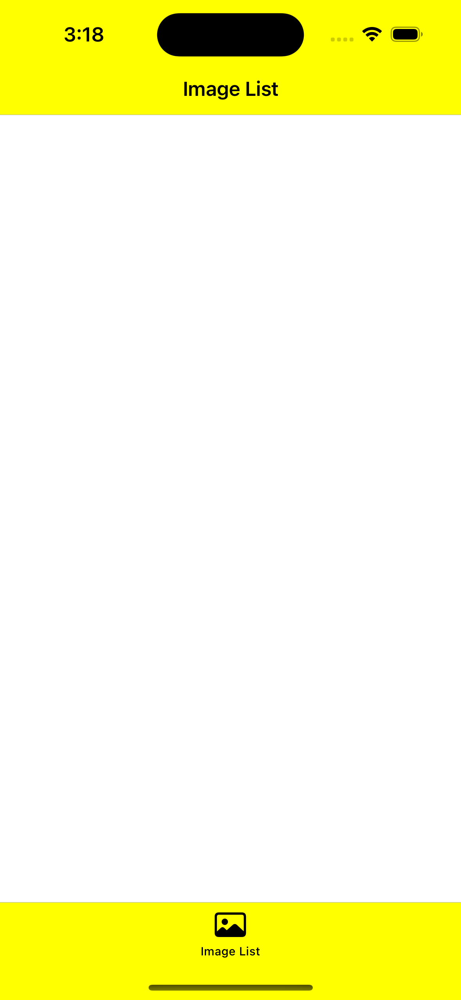

### 手順
**Coordinatorの作成**
- 次にログイン画面からメイン画面に遷移するためのCoordinatorを作成していきます。
1. `LoginCoordinator.swift`を`LoginScene`ディレクトリに作成し、以下のコードを記述する。

```
import UIKit

final class LoginCoordinator {
    private let window: UIWindow
    private let navigationController = UINavigationController()

    init(window: UIWindow) {
        self.window = window
    }

    func start() {
        showLogin(in: navigationController)
    }
}
```

- NavigationControllerとは、ViewControllerをスタックさせ表示させるためのViewControllerです。詳しくは後述。

2. `showLogin(in:)`はこのクラス内でしか実行しないため、以下のようにprivateメソッドとして上記コードの下に記述する。  
※内部でしか使わない関数は必ずprivate拡張の中に入れる。そうすることで、関数が内部でしか使われていないことを明示でき、可読性が上がる。

```
// MARK: - Private Functions
private extension LoginCoordinator {
    func showLogin(in navigationController: UINavigationController) {
        let storyboard = UIStoryboard(name: "Login",
                                      bundle: nil)
        if let vc = storyboard.instantiateViewController(withIdentifier: "LoginViewController") as? LoginViewController {
            navigationController.setViewControllers([vc],
                                                    animated: true)
            window.rootViewController = navigationController
        }
    }
}
```

3. `AppDelegate`内の処理を書き換える。`didFinishLaunchingWithOptions`の中を以下に置き換え、クラス変数に`private var loginCoordinator: LoginCoordinator?`を追加する。

```
func application(_ application: UIApplication, didFinishLaunchingWithOptions launchOptions: [UIApplication.LaunchOptionsKey: Any]?) -> Bool {
    // 一つのスクリーンを表すインスタンス。Keyになっているものがユーザーのアクションを受け取る。
    window = UIWindow(frame: UIScreen.main.bounds)
    window?.makeKeyAndVisible()
    showLoginScreen()

    return true
}
```

4. `AppDelegate`のprivate関数として、`showLoginScreen()`を定義する。

```
func showLoginScreen() {
    if let window,
        loginCoordinator == nil {
        loginCoordinator = LoginCoordinator(window: window)
        loginCoordinator?.start()
    }
}
```

- これでCoordinatorがstartした際にLogin画面が立ち上がる、Coordinator基本パターンが出来上がりました。

**メイン画面にCoordinateする**
- いよいよCoordinatorの最大の特徴である、画面間の遷移を実装していきます。
1. `ImageListScene`に`ImageListCoordinator.swift`を作成し、以下のコードを記述する。

```
import UIKit

final class ImageListCoordinator {
    // MARK: Private properties
    private let navigationController: UINavigationController

    init(navigationController: UINavigationController) {
        self.navigationController = navigationController
    }

    func start() {
        showImageListScreen()
    }
}

private extension ImageListCoordinator {
    func showImageListScreen() {
        let storyboard = UIStoryboard(name: "ImageList",
                                      bundle: nil)
        if let viewController = storyboard.instantiateViewController(withIdentifier: "ImageListViewController") as? ImageListViewController {
            navigationController.pushViewController(viewController,
                                                    animated: true)
        }
    }
}
```

- しかしこのままではLogin画面でのログインボタン押下イベントをImageListCoordinatorで検知する事ができません。コード上で両者が繋がっていないためです。ここで登場するのが、Delegateメソッドです。  
`LoginCoordinator`に以下を記述します。

```
protocol LoginCoordinatorDelegate: AnyObject {
    func goToMain()
}

final class LoginCoordinator {
    ...
    // MARK: Public properties
    weak var delegate: LoginCoordinatorDelegate?
    ...
}

private extension LoginCoordinator {
    func showMain() {
        delegate?.goToMain()
    }
}
```

- showMainを呼ぶと、delegate先でgoToMainの処理が実行されるようになりました。

2. `AppDelegate`に下記を追記する。

```
...
// MARK: - Private functions
private extension AppDelegate {
    func showLoginScreen() {
        if let window,
           loginCoordinator == nil {
            loginCoordinator = LoginCoordinator(window: window)
            loginCoordinator?.delegate = self // <-- 追記
            loginCoordinator?.start()
        }
    }

    func showImageList() {
        let imageListCoordinator = ImageListCoordinator(navigationController: navigationController)
        imageListCoordinator.start()
    }
    ...
}

...
// MARK: - LoginCoordinatorDelegate
extension AppDelegate: LoginCoordinatorDelegate {
    func goToMain() {
        showImageList()
    }
}
```

- これでLoginCoordinatorのdelegateにAppDelegateが入ることにより、LoginCoordinatorで`goToMain`が実行された場合、Delegate先である`AppDelegate`で`showImageList()`が実行されるようになりました。

3. `LoginViewController`でボタンの処理を追記する。

```
protocol LoginViewControllerDelegate: AnyObject {
    func LoginViewControllerDidRequestToShowMainScreen()
}

final class LoginViewController: UIViewController {
    weak var delegate: LoginViewControllerDelegate?
    ...
    @IBOutlet private var loginButton: UIButton! {
        didSet {
            loginButton.setTitle("Login",
                                 for: .normal)
            loginButton.addAction(.init { [weak self] _ in
                self?.delegate?.LoginViewControllerDidRequestToShowMainScreen()
            },
                                  for: .touchUpInside)
        }
    }
}
```

4. 最後に、`LoginViewController.swift`のDelegate処理を`LoginCoordinator`に委譲するために、`LoginCoordinator.swift`に以下を記述する。

```
// MARK: - LoginViewControllerDelegate
extension LoginCoordinator: LoginViewControllerDelegate {
    func LoginViewControllerDidRequestToShowMainScreen() {
        showImageList()
    }
}
```

- こうすることで、loginButton押下時にimageList画面に遷移する事ができるようになりました。

**タブバーの実装**
- これでCoordinatorによってLogin画面からImageList画面に遷移できるようになりましたが、本アプリは複数のメイン画面から構成されるため、切り替えを簡単にするためのタブバーを実装しましょう。

1. `BaseTabScene`を作成し、`BaseTabViewController.swift`を作成、以下のコードを記述する。

```
import UIKit

final class BaseTabViewController: UITabBarController {
    class func initialize(navigationControllers: [UINavigationController]) -> BaseTabViewController {
        let viewController = BaseTabViewController()
        viewController.setViewControllers(navigationControllers,
                                          animated: false)
        viewController.setupUI()
        return viewController
    }
}

// MARK: - Private properties
private extension BaseTabViewController {
    func setupUI() {
        setupTabBar()
    }

    func setupTabBar() {
        let appearance = UITabBarAppearance()
        appearance.backgroundColor = .yellow
        UITabBar.appearance().standardAppearance = appearance
        UITabBar.appearance().scrollEdgeAppearance = appearance
        tabBar.isTranslucent = false
        tabBar.tintColor = .black
    }
}
```
- UITabBarControllerの構成→setViewControllersにより設定されたNavigationController全てについてタブを作成します。タブごとのタイトル、画像は各ViewControllerで実装します。

2. `BaseTabCoordinator.swift`を作成、以下のコードを記述する。
```
import UIKit

final class BaseTabCoordinator {
    // MARK: Private properties
    private let window: UIWindow
    private var rootViewController: BaseTabViewController?

    private lazy var imageListNavigationController: UINavigationController = {
        let navigationController = UINavigationController()
        setupNavigationViewController(navigationController)
        navigationController.tabBarItem.title = "Image List"
        navigationController.tabBarItem.image = UIImage(systemName: "photo")
        return navigationController
    }()

    private lazy var imageListCoordinator: ImageListCoordinator = {
        let coordinator = ImageListCoordinator(navigationController: imageListNavigationController)
        return coordinator
    }()

    init(window: UIWindow) {
        self.window = window
    }

    func start() {
        let viewControllers = [imageListNavigationController]
        rootViewController = BaseTabViewController.initialize(navigationControllers: viewControllers)
        window.rootViewController = rootViewController
        imageListCoordinator.start()
    }
}

// MARK: - Private functions
private extension BaseTabCoordinator {
    func setupNavigationViewController(_ navigationController: UINavigationController) {
        navigationController.navigationBar.isTranslucent = false
        let appearance = UINavigationBarAppearance()
        appearance.backgroundColor = .yellow
        navigationController.navigationBar.standardAppearance = appearance
        // これを設定しないと、スクロールし切った状態(スクロールできない状態を含む)のナビゲーションバーがdefault設定(真っ黒)になる。
        navigationController.navigationBar.scrollEdgeAppearance = appearance
    }
}
```

- lazyとは、{}内の処理が全て終わった後にその変数を使用するための修飾子です。詳しくは後述。

3. ImageListに直接遷移していた処理を全てBaseTab経由に変更します。
- まず、`LoginViewController.swift`の変更をします。
  - `LoginViewControllerDidRequestToShowMainScreen`を右クリック(どこのものでも大丈夫です)→ Refactor > Rename →`LoginViewControllerDidRequestToShowBaseTabScreen`に変更

- 次に、`LoginCoordinator.swift`を変更します。
  - `goToMain`をRefactorで`goToTabBar`に変更
  - `showImageList`をRefactorで`showBaseTabScreen`に変更
  - `showBaseTabScreen`の中身を下記に変更

```
func showBaseTabScreen() {
    delegate?.goToTabBar()
}
```

- 最後に、`AppDelegate.swift`を変更します。

```
class AppDelegate: UIResponder, UIApplicationDelegate {
    ...
    private var baseTabCoordinator: BaseTabCoordinator?
    ...
}

// MARK: - Private functions
private extension AppDelegate {
    func showLoginScreen() {
        ...
        baseTabCoordinator = nil
    }

    func showBaseTabScreen() {
        if let window,
           baseTabCoordinator == nil {
            baseTabCoordinator = BaseTabCoordinator(window: window)
            baseTabCoordinator?.start()
        }
        loginCoordinator = nil
    }
}

// MARK: - LoginCoordinatorDelegate
extension AppDelegate: LoginCoordinatorDelegate {
    func goToTabBar() {
        showBaseTabScreen()
    }
}

```

- これでMain画面がTabBarに内包されたImageListになりました。
